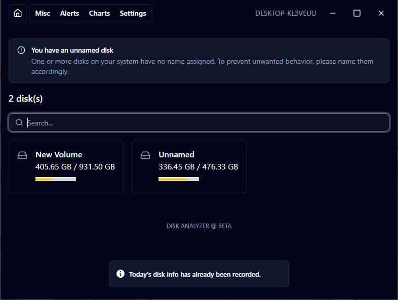

# Disk Analyzer

Analyzes disk usages over time.



## Getting Started

1. Install dependencies
   ```
   npm i
   ```
2. Run development build
   ```
   npm run tauri dev
   ```
3. Build for production
   ```
   npm run tauri build
   ```
4. Test rust
   ```
   cargo test
   ```
5. Format rust
   ```
   cargo fmt
   ```

## Recommended IDE Setup

- [VS Code](https://code.visualstudio.com/)
- [Svelte](https://marketplace.visualstudio.com/items?itemName=svelte.svelte-vscode)
- [Tauri](https://marketplace.visualstudio.com/items?itemName=tauri-apps.tauri-vscode)
- [rust-analyzer](https://marketplace.visualstudio.com/items?itemName=rust-lang.rust-analyzer)

## Links

- [svelte-shadcn](https://shadcn-svelte.com/docs)
- [Rust Book](https://doc.rust-lang.org/book/)
- [Rust by Example](https://doc.rust-lang.org/rust-by-example/index.html)
- [Svelte](https://svelte.dev/)
- [Lucide](https://lucide.dev/)
- [Tauri](https://v2.tauri.app/)
